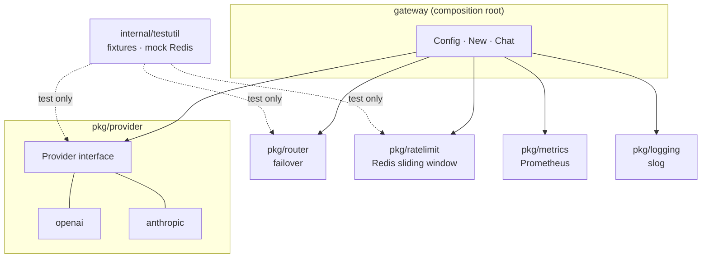
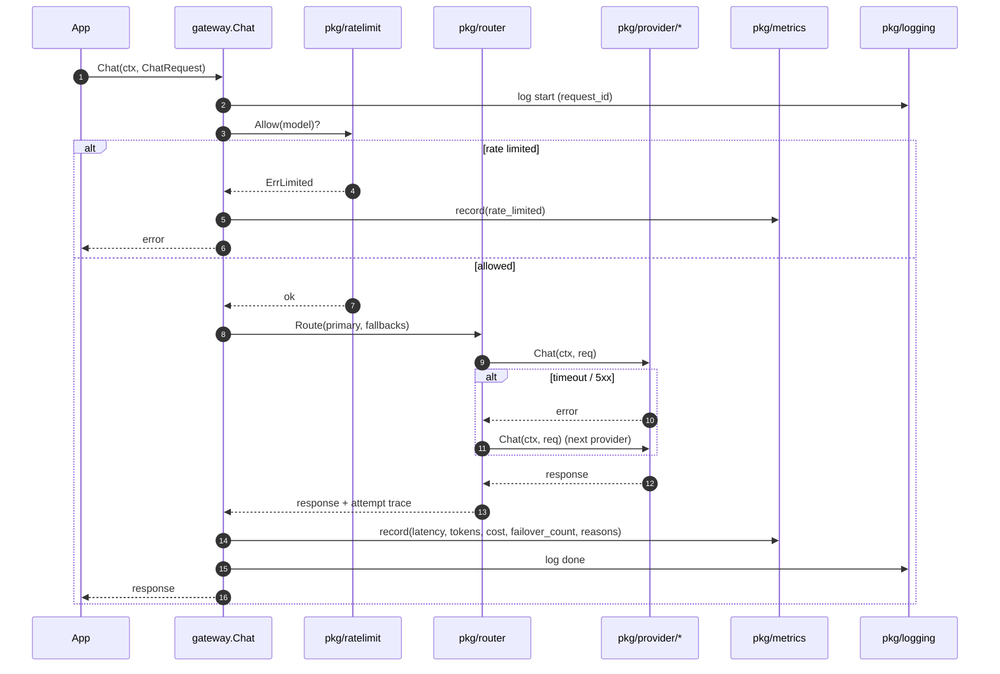

# Architecture

Target: v0.1 (2026-07-06). See [v0.1-scope.md](v0.1-scope.md) for the In/Out scope. The diagrams below visualize decisions already made there — they don't introduce new ones.

## Component dependencies

The top-level `gateway` package is the **composition root**. No `pkg/*` knows about another `pkg/*`. `internal/testutil` is consumed only by `_test.go` files.

## Chat() request flow

Illustrative — current intent based on `v0.1-scope.md`. Exact wiring lands with ADR-002+.

## Module boundary rules

| ✅ Allowed | ❌ Forbidden |
|---|---|
| `gateway` imports any `pkg/*` | `pkg/foo` imports `pkg/bar` |
| `pkg/*` imports `internal/testutil` (in `_test.go` only) | `pkg/*` imports `gateway` |
| `pkg/*` imports standard library + small, well-known third-party libs | Cyclic imports between any packages |
| Composition (wiring providers, router, ratelimit, metrics) lives in `gateway` | Composition leaking into `pkg/*` |

Enforcement: PR review for v0.1. Once we have working code, automate with `go vet -mod=mod` or a depgraph linter (separate ADR).
