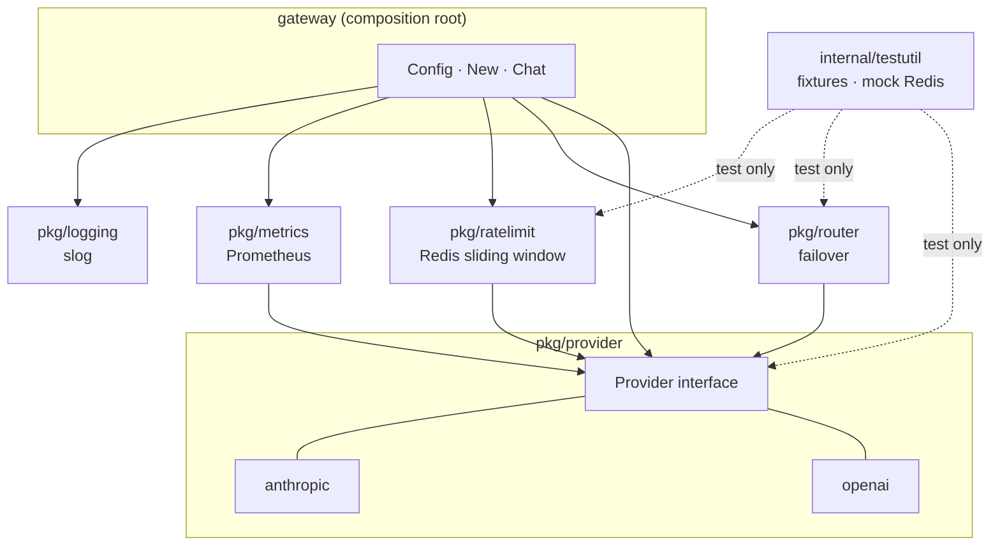
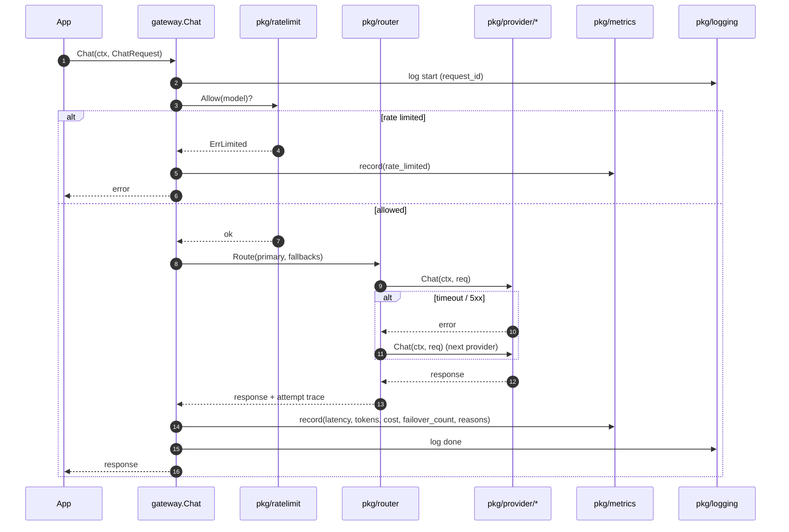

# 아키텍처

목표: v0.1 (2026-07-06). 스코프(In/Out) 는 [v0.1-scope.md](v0.1-scope.md) 참고. 아래 다이어그램은 거기 정해진 결정을 시각화할 뿐, 새 결정을 도입하지 않는다.

## 컴포넌트 의존 관계

최상위 `gateway` 패키지가 **composition root** 다. peer feature 패키지 (`router` / `ratelimit` / `metrics` / `logging`) 는 서로를 모른다. 단 `pkg/provider` 는 base interface layer 라서 위 peer 들이 한쪽 방향으로 의존한다. `internal/testutil` 은 `_test.go` 파일에서만 import 된다.

## Chat() 요청 흐름

`v0.1-scope.md` 의 의도를 그린 일러스트레이션 — 실제 배선은 ADR-002+ 에서 확정.

## 모듈 경계 규칙

| ✅ 허용 | ❌ 금지 |
|---|---|
| `gateway` 가 임의 `pkg/*` import | `pkg/router` ↔ `pkg/ratelimit` ↔ `pkg/metrics` ↔ `pkg/logging` 같은 **peer feature 패키지 끼리** import |
| **`pkg/* → pkg/provider`** (provider 는 base interface layer — 누구나 의존 가능, 다만 반대 방향은 금지) | `pkg/provider → pkg/router` 등 base 가 peer 를 import (계층 역행) |
| `pkg/*` 가 `internal/testutil` import (`_test.go` 안에서만) | `pkg/*` 가 `gateway` 를 import |
| `pkg/*` 가 표준 라이브러리 + 작고 검증된 third-party 라이브러리 import | 어떤 패키지 간이든 cyclic import |
| 합성(provider, router, ratelimit, metrics wiring) 은 `gateway` 안에서만 | 합성이 `pkg/*` 로 새 나가는 것 |

강제: v0.1 동안은 PR 리뷰. 실제 코드가 쌓이면 `go vet -mod=mod` 나 depgraph 린터로 자동화 (별도 ADR).
